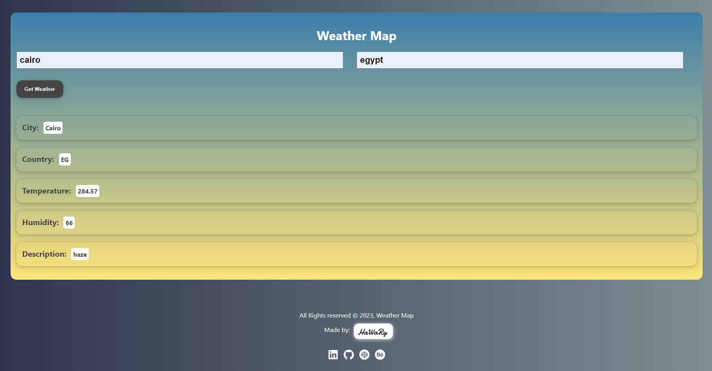

# Weather Map

[](https://app.netlify.com/sites/weathermap14/deploys)

Weather Map is a forecasting weather App that allows you to get the weather conditions of a location you choose. It depends on the API of OpenWeatherMap website.

You can view the App from [here](https://weathermap14.netlify.app/)

 

## Demo

https://user-images.githubusercontent.com/69651552/218345680-e9669a47-a20d-4610-b83e-a7f911e3bb69.mp4

## Instructions, Building & Get Started 

    - 1- Fork, clone or download this repository to your local machine.
    - 2- Be sure that you install the Node.js environment in your machine.
    - 3- Open your terminal and be sure that you are inside the correct destination of the App, while you must be in the same path of the package.json file.
    - 4- Create a (.env) file and add the following environment variables into it:

        ```
        REACT_APP_BASE_URL="Add here the OpenWeatherMap base URL"
        REACT_APP_KEY="Add here the OpenWeatherMap API Key"
        ```
    - 5- Inside your terminal run these commands:-
    
        * to install dependencies.
        ```
        npm install
        ```
        * to start the server.
        ```
        npm start
        ```
    - 6- Once the App server is running, visit (localhost:3000) in the browser to view the App and now you can treat with it as shown above in the Demo.
    - 7- You can also see a live preview of the App from this link (https://weathermap14.netlify.app/)

## Built with

* HTML
* CSS
* JS

## Libraries & Packages

* [React Icons](https://react-icons.github.io/react-icons/)

## Frameworks 

* [React](https://reactjs.org/)  

## API

* [OpenWeatherMap](https://www.OpenWeatherMap.com)  

## Author

* [Mohamed Elhawary](https://www.linkedin.com/in/mohamed-elhawary14/) 

## Contact me through my social accounts

* Email: mohamed.k.elhawary@gmail.com
* [Linkedin](https://www.linkedin.com/in/mohamed-elhawary14/)
* [Github](https://github.com/Mohamed-Elhawary)  
* [Behance](https://www.behance.net/mohamed-elhawary14)
* [Codepen](https://codepen.io/Mohamed-ElHawary) 

## License

Licensed under the [MIT License](LICENSE)
